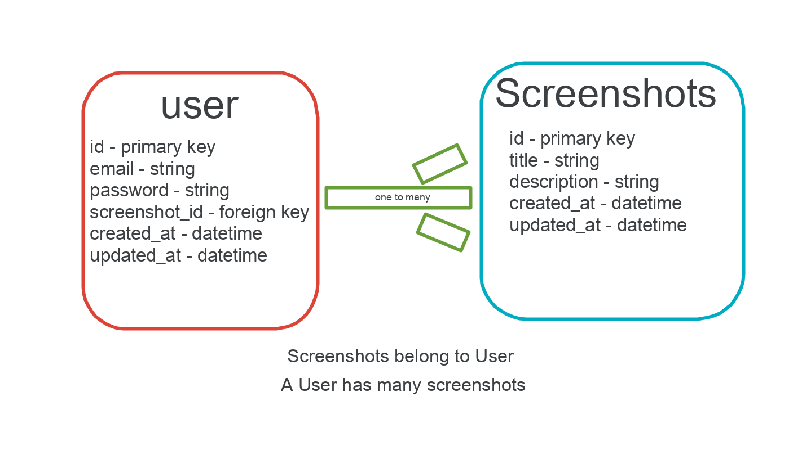

### Stalgiac #
If you live by taking screenshots, or you occassionally take a few here and there, Stalgiac can help you. Screenshots are great to snap information--in the moment--that we don't want to lose; or quickly store info that we want to revisit. Storing screenshots on computers and mobile devices can be daunting, and unorganized. On mobile devices, depending on your screenshotting tendencies, it can also take up memory and lead to clutter. Que Stalgiac!  An app where you upload your screenshots, add important titles and key notes that you don't want to forget, and then once uploaded you have access to them in one organized location. Revisit and make edits to your uploaded screenshots as you wish!

### Tech used #

* Python
* Django
* Django Rest Framework
* PostgreSQL
* Heroku

### API Documentation #
[Stalgiac-Client-Deployed](https://www.shaneajames.com/stalgiac-client/)

[Stalgiac-Client-Repo](https://github.com/shanejames90/stalgiac-client)

[Heroku Deployed](https://stalgiac-api.herokuapp.com/)

### Planning and Organization #
Agile methods were used in the devleopment of this application. A component by component build approach was followed.

Organizational method of the project:

+ Set Up; ERD, wireframes, user stories
+ API Models
+ API Views
+ API Serializers
+ API route config
+ API testing/debug
+ Component Builds
+ Axios requests from client to API testing
+ Deployment using GitHub and Heroku
+ Debug
+ Final Touches

### Routes #

| METHOD    | Endpoint         | Controller#Action | `AuthenticatedRoute`? |
|------------|------------------|-------------------|-------|
| POST    | `sign-up/`       | users#signup    | No |
|   POST  | `sign-in/`       | users#signin    | No |
| PATCH    | `change-password/` | users#changepw  | Yes |
| DELETE    | `sign-out/`        | users#signout   | Yes |

| METHOD    | Endpoint         | Controller#Action | `AuthenticatedRoute`? |
|------------|------------------|-------------------|-------|
| GET    | `/`       | users#landingpage   | No |
| GET   | `screenshots/`       | users#indexscreenshots    | Yes|
| POST    | `screenshots/`        | users#postscreenshot   | Yes |
| GET   | `screenshots/<int:pk>/` | users#showscreenshot  | Yes |
| PATCH    | `screenshots/<int:pk>/`        | users#updatescreenshot   | Yes |
| DELETE    | `screenshots/<int:pk>/`        | users#deletescreenshot   | Yes |

### ERD #

### Set Up and Installation #
+ Django version: 3.0
+ Python version: 3.7
+ Requires gunicorn package
+ Requires Whitenoise package
+ Please see Pipfile for a full list of dependencies

Set up:
+ Fork and clone.
+ Create a .env file.
+ Add a key ENV with the value development exactly.
+ Run pipenv shell to start up your virtual environment.
+ Run pipenv install to install dependencies.

### Future Plans, Problems to solve #
For future versions of Stalgiac, there a few things to implement. First off, this is somewhat trivial, however, the view for changing a password needs to be done via a modal to match sign in and sign up. Also, OCR technology will be added to search the text of uploaded screenshots.  This will allow a user to search for specific within the actual screenshot.
